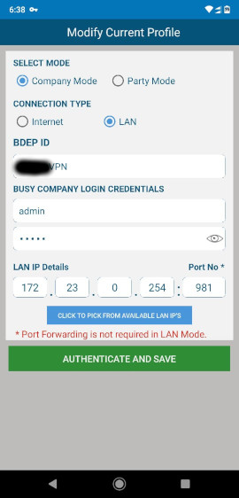

# Ansible — Access BUSY behind NAT

On certain ISPs like [Jio](https://www.jio.com/), it is not possible to access a server over the internet. This can happen if the ISP does not allow incoming connections on the dynamic IP address. As a result, it is not possible to access [BUSY](https://busy.in/) using the provided [Mobile App](https://www.busywinsoftware.com/products/busy-mobile-app/).

## Solution Overview

The Ansible playbook in this repository creates a private [OpenVPN](https://openvpn.net/) network. The [BUSY Mobile App](https://www.busywinsoftware.com/products/busy-mobile-app/) can then connect to the [BUSY server](https://busy.in/) over the virtual network using the “LAN” profile.




## Code Mirrors

* GitHub: [github.com/k3karthic/ansible__freebsd-basic](https://github.com/k3karthic/ansible__freebsd-basic)
* Codeberg: [codeberg.org/k3karthic/ansible__freebsd-basic](https://codeberg.org/k3karthic/ansible__freebsd-basic)

## Deploy for Free

You can run the OpenVPN server for free by using the [Oracle Cloud Always Free](https://www.oracle.com/cloud/free/#always-free) tier. Terraform script for deploying the server is below,
* terraform__oci-instance-1
    * GitHub: [github.com/k3karthic/terraform__oci-instance-1](https://github.com/k3karthic/terraform__oci-instance-1)
    * Codeberg: [codeberg.org/k3karthic/terraform__oci-instance-1](https://codeberg.org/k3karthic/terraform__oci-instance-1)

The following Ansible playbook covers the Basic setup (e.g, swap, fail2ban),
* ansible__ubuntu-basic
    * GitHub: [github.com/k3karthic/ansible__ubuntu-basic](https://github.com/k3karthic/ansible__ubuntu-basic)
    * Codeberg: [codeberg.org/k3karthic/ansible__ubuntu-basic](https://codeberg.org/k3karthic/ansible__ubuntu-basic)

You can get a free static hostname for the OpenVPN server using the Ansible playbook below,
* ansible__oci-ydns
    * GitHub: [github.com/k3karthic/ansible__oci-ydns](https://github.com/k3karthic/ansible__oci-ydns)
    * Codeberg: [codeberg.org/k3karthic/ansible__oci-ydns](https://codeberg.org/k3karthic/ansible__oci-ydns)

## Requirements

Install the following before running the playbook,
```
$ pip install oci
$ ansible-galaxy collection install oracle.oci
```

## Dynamic Inventory

The Oracle [Ansible Inventory Plugin](https://docs.oracle.com/en-us/iaas/Content/API/SDKDocs/ansibleinventoryintro.htm) dynamically populates public Ubuntu instances.

All target instances must have the freeform tag `openvpn_service: yes`.

## Certificate Authority Setup

We need to create a Certificate Authority (CA) for the OpenVPN server and clients. A key signing server generates and signs certificates used for authentication.

For security, the key signing server should be a standalone server. The OpenVPN server can act as the key signing server for smaller deployments. 

To get started, install [easy-rsa](https://github.com/OpenVPN/easy-rsa) on the system you will be using as the key signing server.

### Initialize easy-rsa

Run the following commands on the key signing server.

Create a new Public Key Infrastructure (PKI) and CA,
```
$ ./easyrsa init-pki
$ ./easyrsa build-ca
```

### Create files for OpenVPN server

Run the following commands on the key signing server.

Create and sign a certificate for the OpenVPN server,
```
$ ./easyrsa gen-req Relay
$ ./easyrsa sign-req server Relay
```

Generate the Diffie-Hellman (DH) parameters for the OpenVPN server,
```
$ ./easyrsa gen-dh
```

Copy `pki/ca.crt` and `pki/dh.pem` into the `ca` folder of the current repository. Create a file called `ca/Relay.pass` with the passphrase of the Relay private key (Relay.key).

Install OpenVPN on the key signing server and run the following command. This is only required to generate a shared secret for TLS authentication.
```
$ openvpn --genkey --secret ta.key
```

Copy `ta.key` into the `ca` folder of the current directory.

### Create files for BUSY server

Run the following commands on the key signing server. 

Create and sign a certificate for the BUSY server,
```
$ ./easyrsa gen-req BUSY
$ ./easyrsa sign-req client BUSY
```

Copy `pki/ca.crt`, `pki/ta.key`, `pki/private/BUSY.key`, `pki/issues/BUSY.crt` to the BUSY server. Create a file called `BUSY.pass` with the passphrase of the BUSY private key (BUSY.key).

### Create files for BUSY App

Run the following commands on the key signing server.

Create and sign a certificate for the BUSY App,
```
$ ./easyrsa gen-req BUSYMobile1
$ ./easyrsa sign-req client BUSYMobile1
```

Copy `pki/ca.crt`, `pki/ta.key`, `pki/private/BUSYMobile1.key`, `pki/issues/BUSYMobile1.crt` to the phone. Enter the passphrase of the private key during import or in the configuration.

## Playbook Configuration

1. Update `inventory/oracle.oci.yml`,
    1. specify the region where you have deployed your server on Oracle Cloud.
    1. Configure the authentication as per the [Oracle Guide](https://docs.oracle.com/en-us/iaas/Content/API/Concepts/sdkconfig.htm#SDK_and_CLI_Configuration_File).
1. Set username and ssh authentication in `inventory/group_vars/all.yml`.
1. Change the CIDR of the virtual network (172.23.0.0/16) to ensure it does not overlap with your local network.

## Deployment

Run the playbook using the following command,
```
$ ./bin/apply.sh
```

## Client Configuration

The following sample configuration files are in the `resources` directory,
1. *BUSY.ovpn*: configuration for the BUSY server running [OpenVPN Community](https://openvpn.net/community/).
2. *BUSYMobile1.ovpn*: configuration for the phone running BUSY mobile app and [OpenVPN](https://play.google.com/store/apps/details?id=de.blinkt.openvpn&hl=en&gl=US).

Replace the hostname of the OpenVPN server. Change the virtual IP (172.23.0.X) if required.

The BUSY server firewall should allow connections from the OpenVPN virtual network interface.

## Encryption

Encrypt sensitive files (SSH private keys) before saving them. `.gitignore` must contain the unencrypted file paths.

Use the following command to decrypt the files after cloning the repository,

```
$ ./bin/decrypt.sh
```

Use the following command after running terraform to update the encrypted files,

```
$ ./bin/encrypt.sh <gpg key id>
```
